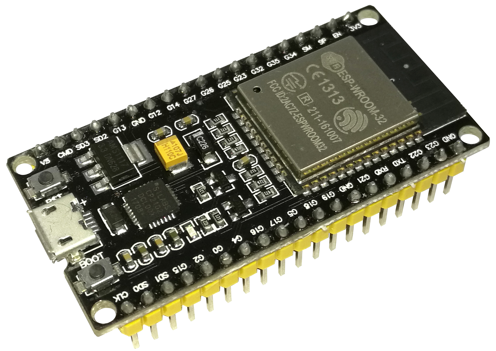
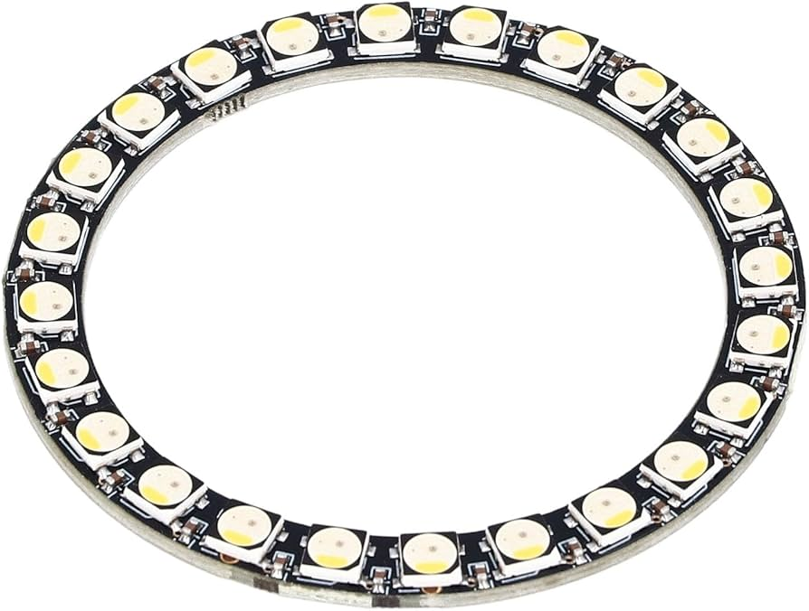

# ESP Home
ESPHome is an amazing platform that allows you to control ESP8266 and ESP32 devices through simple, YAML-based configuration files. With ESPHome, you can easily automate devices, set up sensors, and control lights, all without needing deep programming knowledge.


## ESPHome with Home Assistant

When paired with Home Assistant, ESPHome becomes even more powerful. Home Assistant provides an intuitive interface to control ESPHome devices and monitor them in real-time. Integrating ESPHome with Home Assistant allows seamless access to your device configurations, letting you build a fully connected and customizable home automation system.


## ESPHome Control RGB LED


In this project, the **Ambiance Controller** is designed to manage RGB LED lights to create custom lighting moods. With ESPHome, controlling RGB LEDs is straightforward. You can configure effects like fading, flashing, and color transitions, all accessible from Home Assistant's interface.

## Setting Up the YAML Configuration File

The core of an ESPHome setup is the YAML configuration file. This file tells ESPHome how to handle each connected device, including pin configurations, effects, and integration settings. Here’s a basic example YAML file for controlling an RGB LED with ESPHome:


````yml

substitutions:
  name: esphome-web-bbb4d8
  friendly_name: Cpre-Led

esphome:
  name: ${name}
  friendly_name: ${friendly_name}
  min_version: 2024.6.0
  name_add_mac_suffix: false
  project:
    name: esphome.web
    version: dev

esp32:
  board: esp32-c3-devkitm-1
  framework:
    type: arduino

# Enable logging
logger:

# Enable Home Assistant API
api:

# Allow Over-The-Air updates
ota:
- platform: esphome

# Allow provisioning Wi-Fi via serial
improv_serial:

mqtt:
  broker: 192.168.1.25
  username: cprehome
  password: cpre888

wifi:
  ap: 

# In combination with the `ap` this allows the user
# to provision wifi credentials to the device via WiFi AP.
captive_portal:

dashboard_import:
  package_import_url: github://esphome/firmware/esphome-web/esp32c3.yaml@main
  import_full_config: true

# Sets up Bluetooth LE (Only on ESP32) to allow the user
# to provision wifi credentials to the device.
esp32_improv:
  authorizer: none

# To have a "next url" for improv serial
web_server:

# Example usage in a light
light:
  - platform: neopixelbus
    id: light_1
    type: GRB
    variant: WS2812
    pin: GPIO18
    num_leds: 8
    name: "NeoPixel Light"

output:
  - platform: gpio
    pin: GPIO8
    id: output1

button:
  - platform: output
    name: "Generic Output"
    output: output1
    duration: 50ms

# Example configuration entry


````
