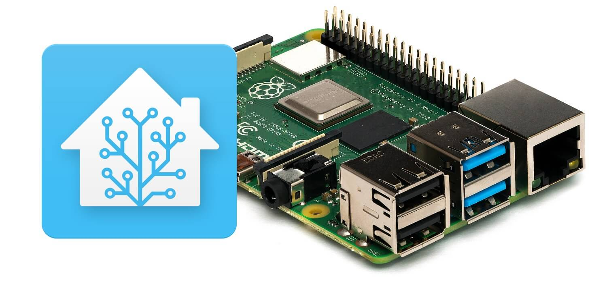

- **Home Assistant**: This is the heart of the automation system, allowing for seamless integration and control of various smart devices.

## About the Ambiance Controller

The Ambiance Controller combines hardware and software to create an environment tailored to the user’s preferences. By leveraging Home Assistant's capabilities and a range of smart devices, the controller can adjust lighting, temperature, and other environmental factors automatically, based on the user’s preferences.

## Key Features

- **Seamless Automation**: Control lighting, temperature, and more based on time of day, presence detection, and environmental conditions.
- **Remote Access**: Manage your home from anywhere using the Home Assistant app.
- **Energy Efficiency**: Automatically adjust devices to save energy while maintaining comfort.

### How to connect to bluetooth with home assitant
Yay, it worked! Thanks for the tip. The missing key for me was spamming that pairing command until it worked. Before I rather spammed scan on and devices to check if it sees it - and when I saw it in the list I tried pairing. Also, I had to throw away my CSR 4.0 adapter that just crashed during the pairing process and needed to restart everytime. Now I’m using EDIMAX BT-8500 which can successfully connect (after few restarts of HA and spam of pair commands).

Btw, here are my steps to get HA play media on BT speaker for others in future (as I always found small fragments of a solution, not a complete package):

Do all previously mentioned stuff to pair and connect BT speaker.
TLDR:
Get BT adapter. Spam following commands until it works:
bluetoothctl scan on
bluetoothctl devices
bluetoothctl pair xx:xx:xx:xx:xx:xx //use address you find through devices command
bluetoothctl trust xx:xx:xx:xx:xx:xx
bluetoothctl connect xx:xx:xx:xx:xx:xx
Some extra useful commands:

bluetoothctl info xx:xx:xx:xx:xx:xx //to see if it's paired/connected/trusted successfully
bluetoothctl show //information about adapter
bluetoothctl help //to see all available commands/settings
Get it registered as audio device with commands:
ha audio restart
ha audio reload
ha audio info
(repeat until you see it in info)
3) Get VLC add-on.
4) Set VLC to that new output (in add-on settings; needs restarting add-on)
5) Play media via interface or any automation (You can use action Play media or there are some advanced actions available as services - starting with media_player. )