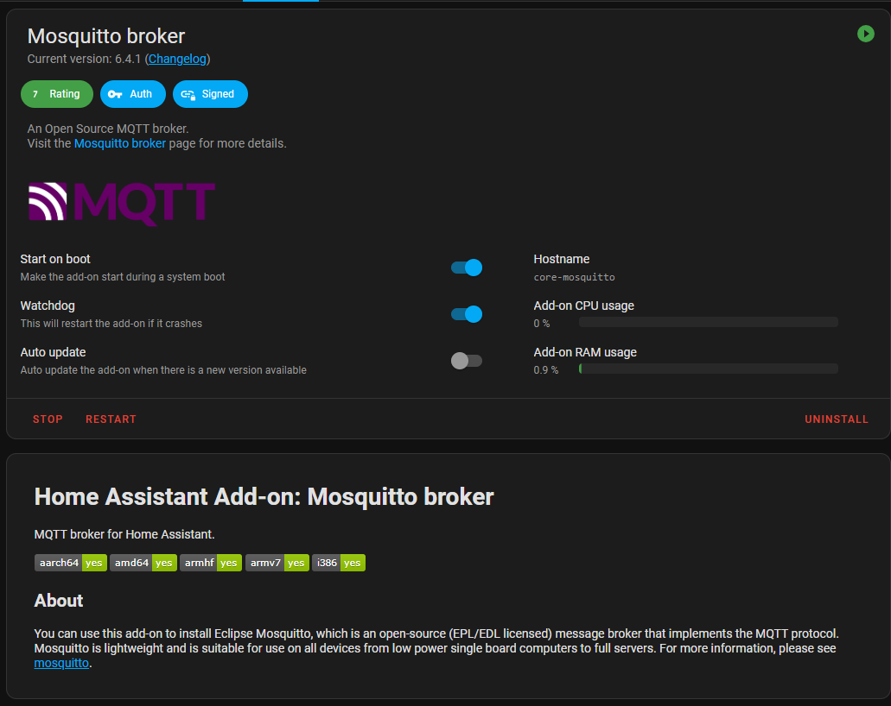
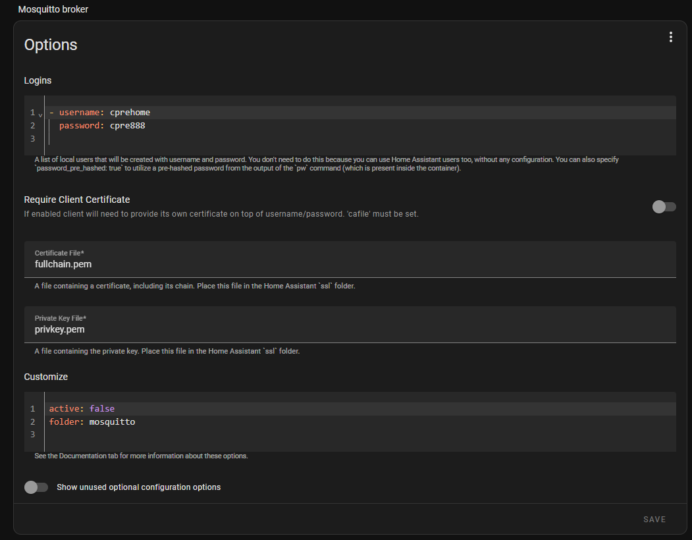
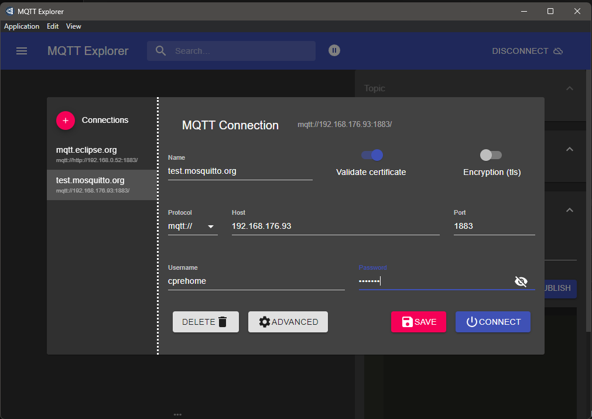

In this guide, we'll walk through using MQTT with Home Assistant, using the popular [Mosquitto](https://mosquitto.org) MQTT broker. This setup will allow Home Assistant to communicate with smart devices on the MQTT protocol, enabling efficient and reliable home automation.

### Setting Up Mosquitto in Home Assistant

To get started, install the Mosquitto broker add-on directly from the Home Assistant add-on store. This broker acts as the primary hub for MQTT messages, allowing various IoT devices to send and receive data through Home Assistant.

> **Note**: Ensure you've configured a secure username and password for the MQTT broker before using it. This is essential for secure device communication.

### Debugging with MQTT Explorer

For testing and debugging your MQTT setup, [MQTT Explorer](https://mqtt-explorer.com) is an invaluable tool. It provides a clear interface to view, subscribe, and publish messages within the MQTT broker, helping you monitor device interactions and troubleshoot any issues.

With this setup, your Home Assistant installation is ready to handle MQTT messages from compatible devices, providing you with a reliable foundation for expanding your smart home capabilities.
