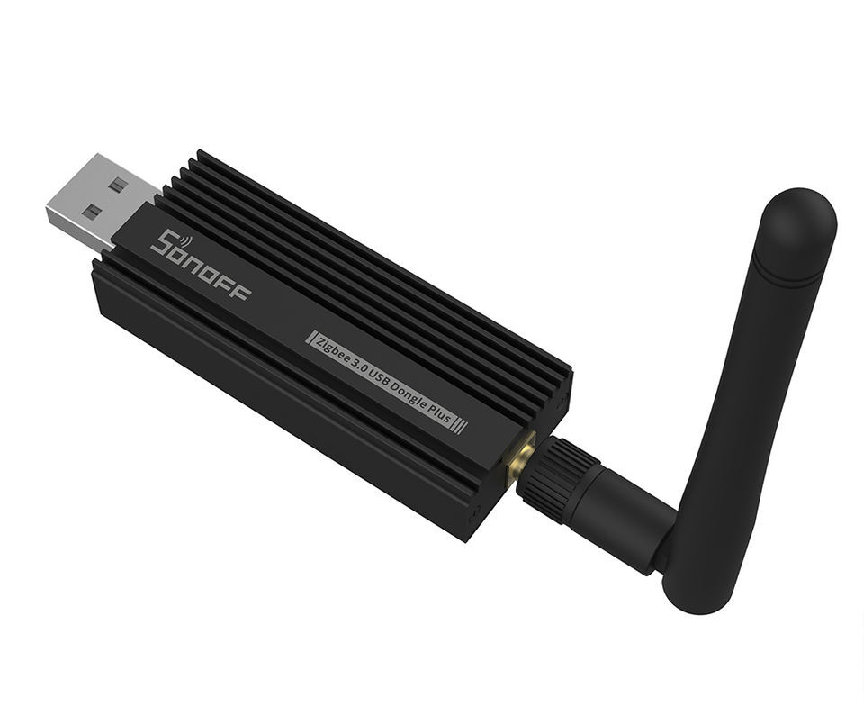
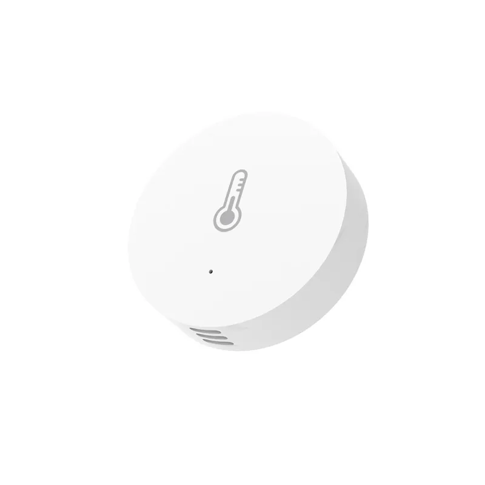

- **Zigbee**: Zigbee protocol enables wireless communication between smart home devices, making it easy to add and control Zigbee-based sensors, switches, and other devices.

### Zigbee 2 MQTT

Using **Zigbee2MQTT** enables us to control and monitor Zigbee devices through MQTT. By integrating Zigbee devices with an MQTT broker, we gain seamless connectivity between our Zigbee devices and our smart home setup. Zigbee2MQTT allows for an open-source, DIY approach to Zigbee device control, providing greater flexibility and customization.

### Zigbee Temperature Sensor

The **Zigbee temperature sensor** is key to managing and automating temperature-based actions within the home. For example, by monitoring temperature changes, we can automate devices like fans, heaters, or air conditioning units to maintain a comfortable ambiance.

### Zigbee Switch

The **Zigbee switch** acts as a physical control point within the system, allowing manual toggling of connected devices. This provides an intuitive way for users to interact with the smart home environment without needing a phone or voice assistant.

## Project Overview

In **Ambiance Controller**, I combine the capabilities of Zigbee devices with MQTT for efficient home automation. This project leverages temperature sensors and switches to create a responsive system that adjusts to environmental changes and user input.

Through this integration, **Ambiance Controller** offers enhanced control over home devices, enabling a more connected and customizable living experience.

